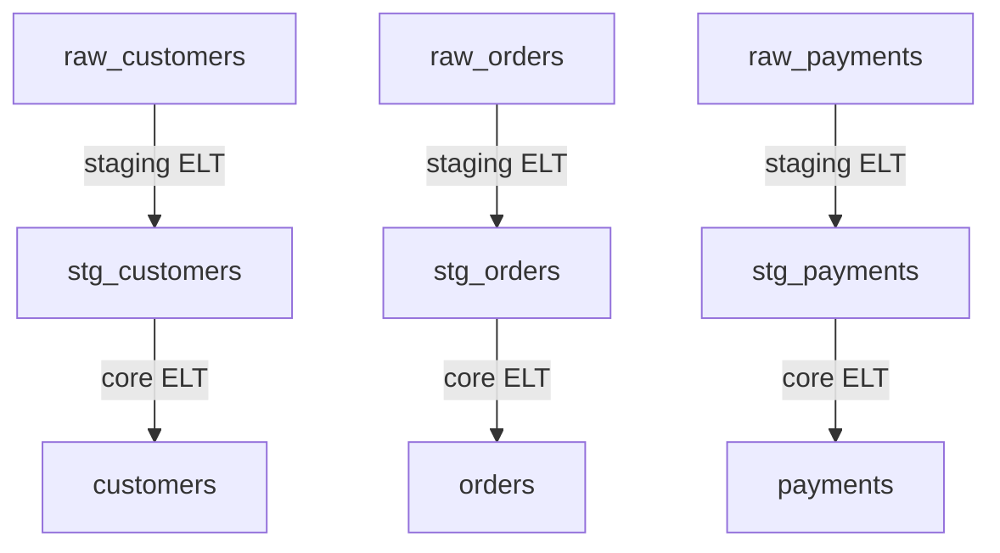

ETL Spike

This spike uses a dummy dataset for a store to demonstrate how Prefect (scheduler), DBT (sql execution) and Great expectations can work together.

You can see the initial csv datasets in the folder `./dbt/etl_spike/seeds`

And here is the diagram of the ELT we are going to use as an example. ([link](https://mermaid.ink/img/pako:eNptkMsKwjAQRX8lzFp_oAvB2voAd7pLRIZmrAWTlGSCiPXfja2IFmc1MOcehnuHymmCDGqP7VnsC2VFmrn0eD1WMbAz5MNBTKezLjDWja1Fud13IpeB6y9iyOUvUHSV8zRgCzlGil7tvP7vLXvv-zwkyrF0KX_uq97Y4s2Q5X_Ode_8AENqPbZu5IeACaSPDTY6NXN_8Qr4TIYUZGnVdMJ4YQXKPhKKkd3uZivI2EeaQGw1MhUNpk4NZCe8BHo8Acb7efE?type=png) to the diagram before if it doesnt render properly)



We will use DBT to run the transformations. Following DBT conventions:
- sources are the original dataset out of the scope
- staging ELT is the step where we do data transformation (casting/renaming)
- core ELT is where we perform aggregations/filtering to create derived tables/views.

At the end of each step, we will test the schemas via `dbt test` as well as via Great Expectations.

# Setup

You need to setup a variable for great_expectations:

```
mkdir great_expectations/uncommitted && echo 'dbpassword: password1234' > great_expectations/uncommitted/config_variables.yml
```  

You need docker-compose (and psql locally if you want to interact with the database)

`make up` To spin up the environment.

Now we will setup a couple things.

We can run on a different terminal the cli with all the dependencies installed:

```
make cli
```

## Database Setup with dbt
once that is done you can run these commands **just once** to populate the initial sources (tables) that the ELT will read from:

From the cli container:
```
cd /root/dbt
sh setup_db.sh
``` 


## Great expectations Data Docs build
                                                   
We will build the initial Great Expectations Data Docs

From the cli container:

```
cd /root/great_expectations
sh docs.sh
```

---

## Prefect ELT
We can run the prefect ELT flow, from the cli container:

```
cd /root/prefect
python flows/etl_flow.py
```

## DBT Snapshots

Snapshots are a good way to track slowly changing dimensions. For example, names/addressess for people/businesses.

We can show an example easily. 

We can open connect to the postgres data warehouse:

```make psql```

Then check the data for a customer:

```
select * from public.customers where customer_id=1;
```

Which should return the following:

```
dbt=# dbt=# select * from public.customers where customer_id=1;
 customer_id | first_name | last_name | first_order | most_recent_order | number_of_orders | customer_lifetime_value 
-------------+------------+-----------+-------------+-------------------+------------------+-------------------------
           1 | Michael    | P.        | 2018-01-01  | 2018-02-10        |                2 |                      33

```

Now lets say the source data has changed, we ingest a source  again and where these 2 events have happened:
- the name for this particular customer (id=1) has changed.
- there is a new customer 

We can recreate these event via the following sql commands. Please notice we are updating the sources table (which includes the seeded data that represents the sources):

```
  UPDATE public.raw_customers
     SET first_name='UPDATED_NAME'
     WHERE id=1
;
```
and 

```
  INSERT INTO public.raw_customers VALUES  (101,'manuel','garrido');

```

Now lets run the etl again (so `make cli` and then `cd prefect && python flows/elt_flow.py`)

Lets see how the customer table looks like now:

```
dbt=# select * from public.customers where customer_id in (1,101);
 customer_id |  first_name  | last_name | first_order | most_recent_order | number_of_orders | customer_lifetime_value 
-------------+--------------+-----------+-------------+-------------------+------------------+-------------------------
           1 | UPDATED_NAME | P.        | 2018-01-01  | 2018-02-10        |                2 |                      33
         101 | manuel       | garrido   |             |                   |                  |                        
(2 rows)
```

It all makes sense right? we can see the new customer and the existing customer has the updated name.

But what if we wanted to know the customer's name history? FRET NOT, snapshots to the rescue!

Since we have snapshots at the source, and the staging table reads from snapshots, we can see how the staging table actually looks now:


Now we can check the output:

```
    dbt=# select * from public.stg_customers where customer_id in (1,101);
    customer_id |  first_name  | last_name |       dbt_valid_from       |        dbt_valid_to
    -------------+--------------+-----------+----------------------------+----------------------------
            1 | Michael      | P.        | 2022-10-18 10:52:12.793064 | 2022-10-18 11:03:33.663161
            1 | UPDATED_NAME | P.        | 2022-10-18 11:03:33.663161 |
            101 | manuel       | garrido   | 2022-10-18 11:08:26.04012  |
    (3 rows)
```

---

## Prefect Deployment

We can show how to deploy a prefect flow remotely

We will use minio to mimic s3 for flow deployment.

1.Create a Minio bucket
  - go to http://localhost:9001
  - login with `minioadmin` user and password
  - create a bucket named `prefect-flows`

2. Create a Prefect Remote File block.
  - on prefect UI go to blocks, then search for remote file system block.

    **block name:** dev
    **path:** s3://prefect-flows/dev

    **Settings (Optional):**
    ```
    {
      "key": "minioadmin",
      "secret": "minioadmin",
      "client_kwargs": {
        "endpoint_url": "http://minio:9000"
      }
    }
    ```

3. Submit flow deployment
We can do a deployment like this:

```
make prefect-cli
   sh deploy.sh
```

you can now trigger the depliyment via the ui!

### Docker agent

We cant run docker flows from a dockerized agent (docker in docker), but we can run another agent
and make a separate deployment